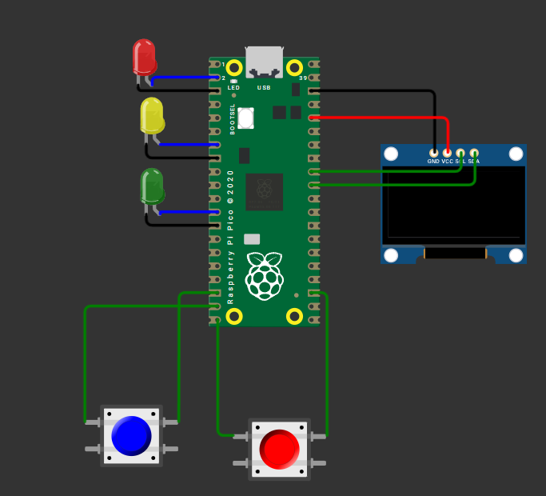

# Project Diary - Muhammeddjan Ademi

Projekttagebuch – 02.03.2026

Heute haben wir richtig mit unserem Projekt ReflexRush gestartet.

Zuerst haben wir ein Mockup erstellt, um zu sehen, wie das Spiel später aussehen soll (Countdown, „GO!“, Punkteanzeige).

Danach haben wir uns die Hardware angeschaut: Pico W, OLED-Display und Buttons. Wir haben überlegt, welche Pins wir benutzen und wie wir alles anschließen.

Anschließend haben wir verschiedene Programmiersprachen recherchiert (C++ / C#) und wahrscheinlich nutzen wir C.

Zum Schluss haben wir Meilensteine festgelegt und die Aufgaben unter uns aufgeteilt.
